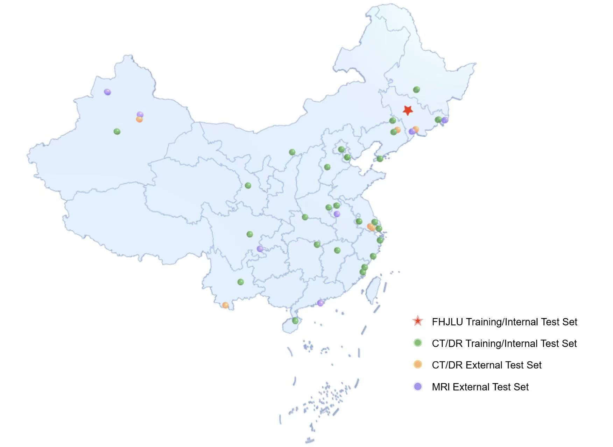

# MIRA: Medical Imaging Report Assistant

## Overview
The study is based on a multi-million-scale, multi-center, multi-modal radiology report dataset. It fine-tunes the large language model **MIRA (Medical Imaging Report Assistant)** and comprehensively evaluates the model’s performance through validation across multiple centers, modalities, and anatomical regions. The video link is: https://www.youtube.com/watch?v=t4lC8i1t_C0.

> **Manuscript Status:**  
> The manuscript is currently under review, and the relevant results will be updated in the future.

## Acknowledgements
We appreciate the support from radiologists at the main center and other participating centers. Special thanks to the following hospitals:

- The First Hospital of Jilin University  
- The First Affiliated Hospital of Harbin Medical University  
- Suzhou Hospital of Integrated Chinese and Western Medicine  
- People's Hospital of Hainan Province  
- People's Hospital of Xishuangbanna Prefecture  
- Wenzhou Medical University  
- Dalian Central Hospital  
- People's Hospital of Taikang County, Henan Province  
- Traditional Chinese Medicine Hospital of Rudong County, Jiangsu Province  
- People's Hospital of Gaochang District, Turpan City  
- Sichuan Provincial People's Hospital  
- Zhongda Hospital, Southeast University  
- Korla Hospital of the Xinjiang Production and Construction Corps  
- Shijiazhuang Huayao Hospital  
- Shengjing Hospital  
- The First Affiliated Hospital of Fujian Medical University  
- The First Affiliated Hospital of Kunming Medical University  
- Tongji Hospital of Shanghai
- The Second Hospital of Lanzhou University  
- The Second Hospital of Tianjin Medical University  
- Peking University Third Hospital  
- Fushun Central Hospital  
- Jiangyin Hospital of Traditional Chinese Medicine  
- The First Affiliated Hospital of Nanchang University of Medical Science  
- The First People's Hospital of Pingjiang County, Hunan Province  
- Xiapu County Hospital, Fujian Province  
- Longmatan District People's Hospital  
- Dushanzi People's Hospital  
- Tianjin Medical University General Hospital  
- Guoyao Hanjiang Hospital of Hubei Province  
- Pukou District Central Hospital, Nanjing  
- People's Hospital of Dongsheng District, Ordos City  
- Hunchun City People's Hospital  
- The Affiliated Hospital of Yanbian University  
- The Second People's Hospital of Mengcheng County, Anhui Province  
- The Fifth Affiliated Hospital of Sun Yat-sen University  
- General Hospital of the Eastern Theater Command  
- The Fifth People's Hospital of Zhuhai City  
- Baishan Central Hospital  
- The Second People's Hospital of Tonghua City  
- The Second People's Hospital of Ningbo City  
- The Fifth People's Hospital of Fuyang City

