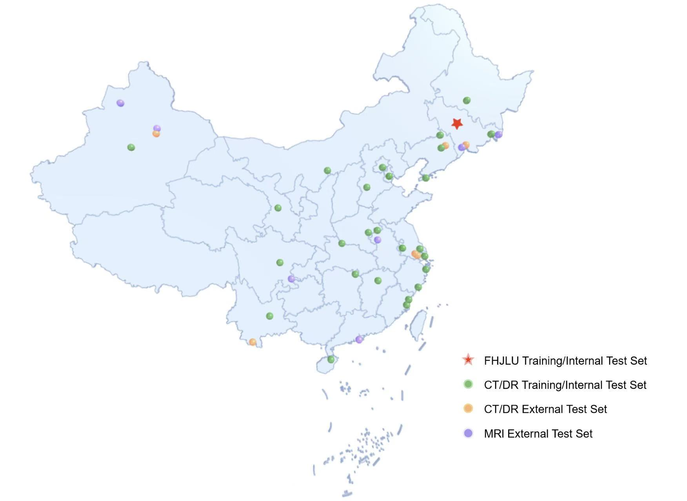
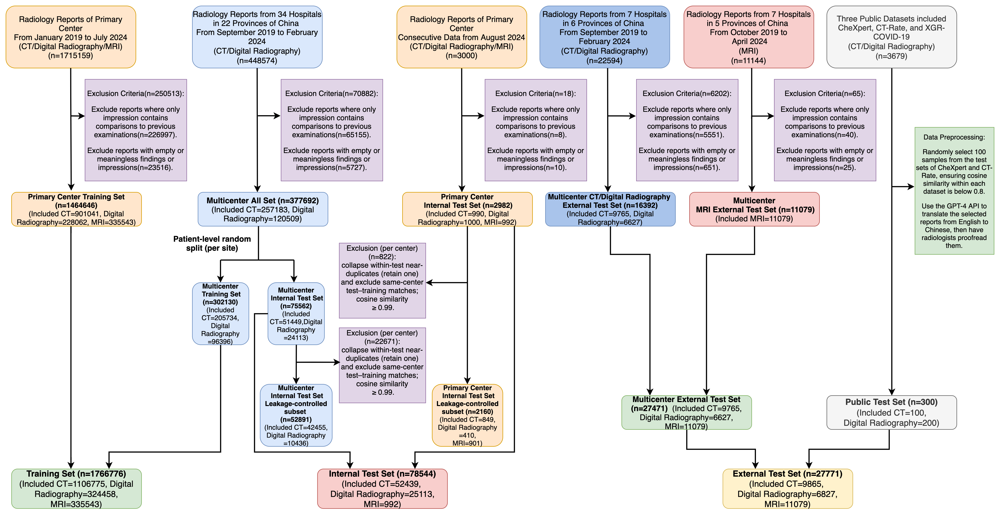
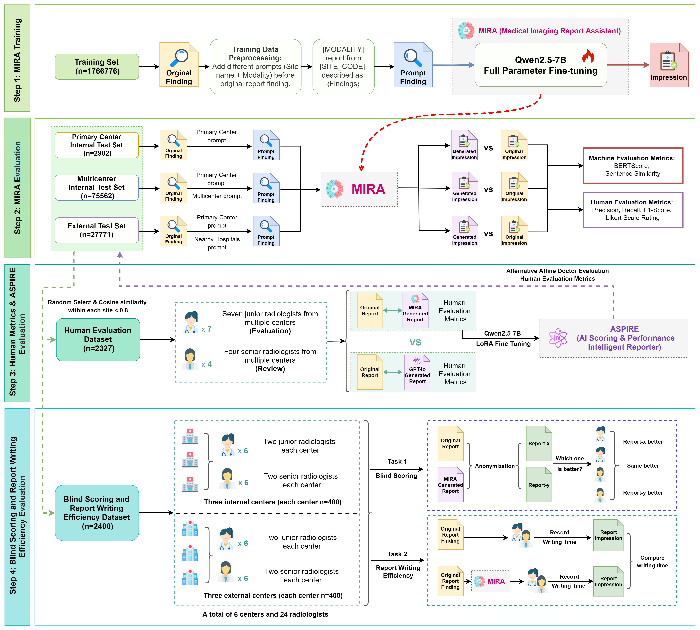
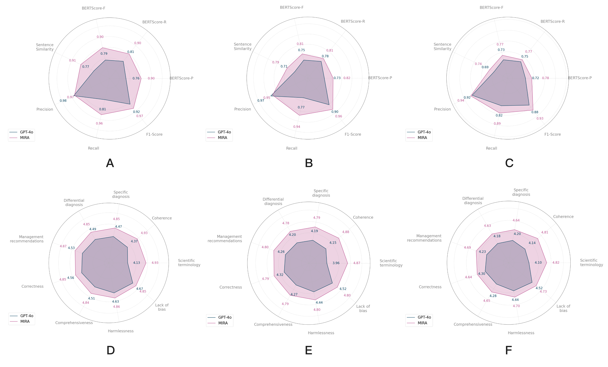
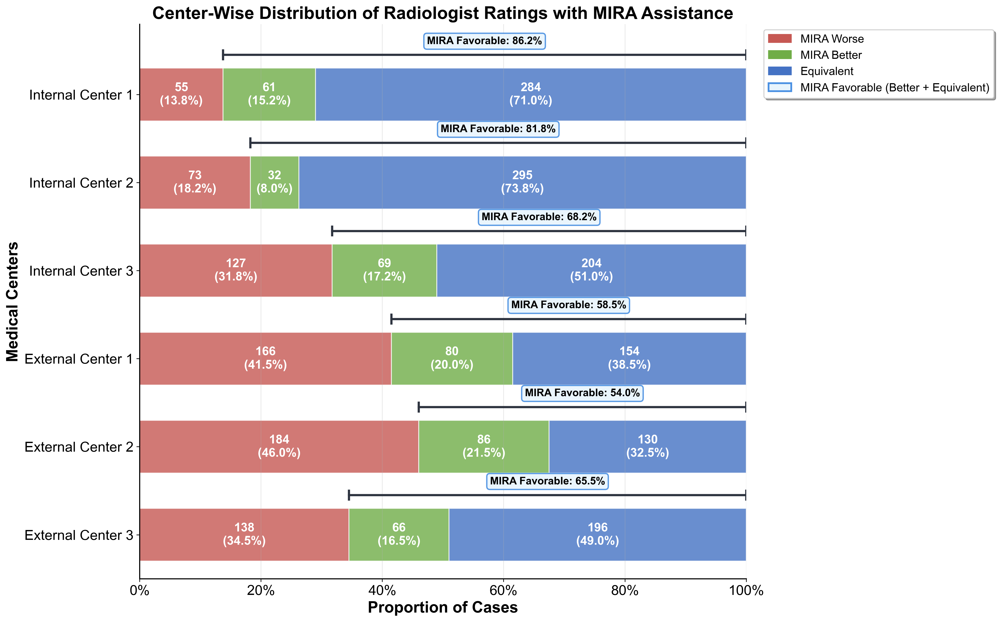
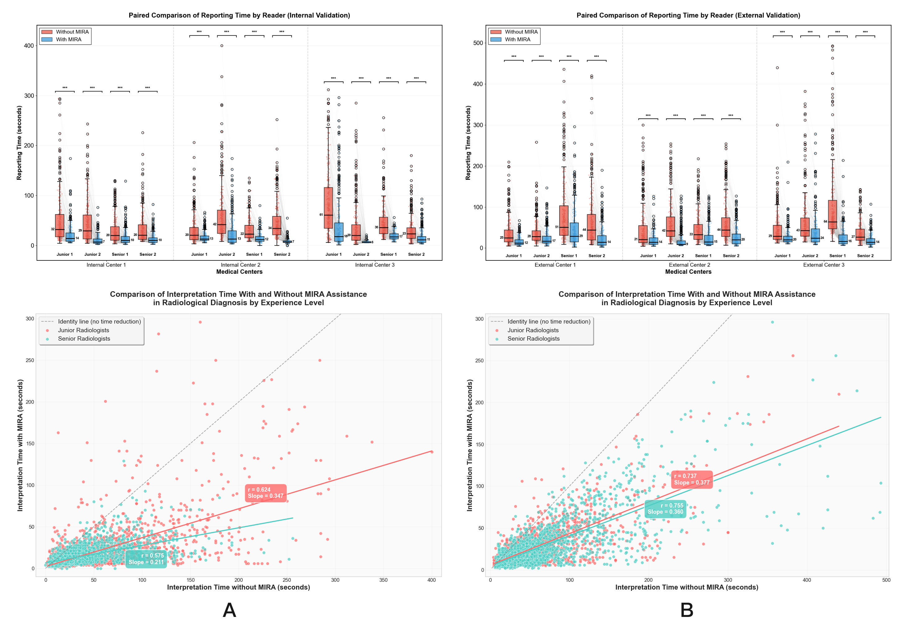

# MIRA: Medical Imaging Report Assistant

## Overview

MIRA (**Medical Imaging Report Assistant**) is a fine-tuned large language model designed for automated radiology impression generation. This study was developed and evaluated using a large-scale, multicenter, multimodal radiology report dataset, including CT, MRI, and digital radiography reports from 42 hospitals across 22 provinces in China.

The model was comprehensively evaluated across multiple centers, modalities, and anatomical regions using automated metrics, radiologist-based human evaluation, and multicenter blinded reader testing. The video link is: https://www.youtube.com/watch?v=t4lC8i1t_C0.

> **Publication Status:**  
> This work has been published as an open-access Original Research article in *Radiology: Artificial Intelligence*.  
>
> **Citation:**  
> Li M, Wang Y, Miao Z, et al. **Fine-Tuned Large Language Model for Automated Radiology Impression Generation: A Multicenter Evaluation**. *Radiology: Artificial Intelligence*. 2026;8(3):e250714. doi:10.1148/ryai.250714.
>
> The code is available in this repository. Model weights and additional resources will be updated according to institutional, ethical, and data-governance requirements.

## Key Results

- MIRA was fine-tuned using **1.87 million radiology reports** from **42 centers**.
- In the internal test set, MIRA achieved a **BERTScore F1 of 0.92** and **sentence similarity of 0.92**.
- In the external test set, MIRA achieved a **BERTScore F1 of 0.82** and **sentence similarity of 0.80**.
- Human evaluation showed that MIRA outperformed GPT-4o in sentence similarity and F1 score.
- In a 2400-examination blinded reader study, MIRA-generated impressions were rated equivalent or superior to reference impressions in **69.0%** of comparisons.
- MIRA reduced impression drafting time by **0.46 minutes per report** and improved interradiologist consistency.

## Key Figures

### Figure 1. Dataset composition and study workflow

### Figure 2. MIRA training, inference, and evaluation framework

### Figure 3. Comparison between MIRA and GPT-4o

### Figure 4. Multicenter blinded scoring results

### Figure 5. Reporting efficiency analysis

In addition, we would like to extend our heartfelt thanks to Professor Zhang Huimao for her invaluable guidance, and to the following radiologists for their dedicated support: Mu Lin, Gong Jiaqi, Wang Yaning, Yang Simin, Mu Ying, Zhou Weipeng, Cui Yingzhu, Hou Lin, Fu Jiahui, Zheng Yiping, Sun Zehua, Chen Jie, Liu Tong, Liu Ke, Li Sinuo, Song Shuang, Li Meixin, Zhou Yuting, and Yu Fuxuan.

## Acknowledgements
We appreciate the support from radiologists at the main center and other participating centers. Special thanks to the following hospitals:

- The First Hospital of Jilin University  
- The First Affiliated Hospital of Harbin Medical University  
- Suzhou Hospital of Integrated Chinese and Western Medicine  
- People's Hospital of Hainan Province  
- People's Hospital of Xishuangbanna Prefecture  
- Wenzhou Medical University  
- Dalian Central Hospital  
- People's Hospital of Taikang County, Henan Province  
- Traditional Chinese Medicine Hospital of Rudong County, Jiangsu Province  
- People's Hospital of Gaochang District, Turpan City  
- Sichuan Provincial People's Hospital  
- Zhongda Hospital, Southeast University  
- Korla Hospital of the Xinjiang Production and Construction Corps  
- Shijiazhuang Huayao Hospital  
- Shengjing Hospital  
- The First Affiliated Hospital of Fujian Medical University  
- The First Affiliated Hospital of Kunming Medical University  
- Tongji Hospital of Shanghai
- The Second Hospital of Lanzhou University  
- The Second Hospital of Tianjin Medical University  
- Peking University Third Hospital  
- Fushun Central Hospital  
- Jiangyin Hospital of Traditional Chinese Medicine  
- The First Affiliated Hospital of Nanchang University of Medical Science  
- The First People's Hospital of Pingjiang County, Hunan Province  
- Xiapu County Hospital, Fujian Province  
- Longmatan District People's Hospital  
- Dushanzi People's Hospital  
- Tianjin Medical University General Hospital  
- Guoyao Hanjiang Hospital of Hubei Province  
- Pukou District Central Hospital, Nanjing  
- People's Hospital of Dongsheng District, Ordos City  
- Hunchun City People's Hospital  
- The Affiliated Hospital of Yanbian University  
- The Second People's Hospital of Mengcheng County, Anhui Province  
- The Fifth Affiliated Hospital of Sun Yat-sen University  
- General Hospital of the Eastern Theater Command  
- The Fifth People's Hospital of Zhuhai City  
- Baishan Central Hospital  
- The Second People's Hospital of Tonghua City  
- The Second People's Hospital of Ningbo City  
- The Fifth People's Hospital of Fuyang City

